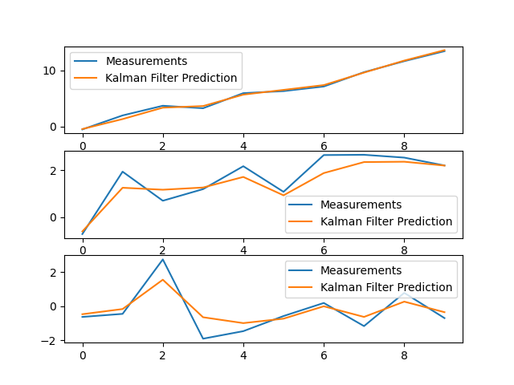

# KalmanFilter-Snippets

# Kalman Filter Implementation

This project implements a Kalman Filter to process data from sensors. The Kalman Filter is a powerful tool for estimating the state of a system based on noisy measurements. This implementation demonstrates how to initialize, predict, and update the state estimates using the Kalman Filter.


## Table of Contents

- [Overview](#overview)
- [Requirements](#requirements)
- [Setup](#setup)
- [Usage](#usage)
- [Output](#output)
- [Explanation](#explanation)

## Overview

The Kalman Filter is implemented in c++ and is designed to handle a state vector of arbitrary dimensions. The filter can be used to process sensor data and provide estimates of the true state of the system.

## Requirements

- gcc compiler with c++11 support
- Matplotlib

## Setup

1. Clone the repository:

   ```bash
   git clone https://github.com/raghunihal/kalman-filter.git
   cd kalman-filter
   ```
2. Install the required packages:

   ```bash
   pip3 install numpy matplotlib
   ```

## Usage

1. Run the `kalman_filter.cpp` script to see the Kalman Filter in action:

 g++ kalman_filter.cpp -std=c++11 -I /usr/local/Cellar/python/3.7.3/Frameworks/Python.framework/Versions/3.7/include/python3.7m 
 -I /usr/local/lib/python3.7/site-packages/numpy/core/include -L /usr/local/Cellar/python/3.7.3/Frameworks/Python.framework/Versions/3.7/lib -lpython3.7

2. The script will simulate some sensor data, process it using the Kalman Filter, and display the results.

## Output

The output will include plots of the measurements and the Kalman Filter predictions for each component of the state vector.



## Explanation


## References

- [Understanding the Basis of the Kalman Filter via a Simple and Intuitive Derivation](https://arxiv.org/pdf/1204.0375)
- [How a Kalman Filter Works in Pictures](https://www.bzarg.com/p/how-a-kalman-filter-works-in-pictures/#mjx-eqn-kalpredictfull)
- [Kalman Filter](https://web.mit.edu/kirtley/kirtley/binlustuff/literature/control/Kalman%20filter.pdf)
- [Understanding Kalman Filters with Python](https://medium.com/@jaems33/understanding-kalman-filters-with-python-2310e87b8f48)
